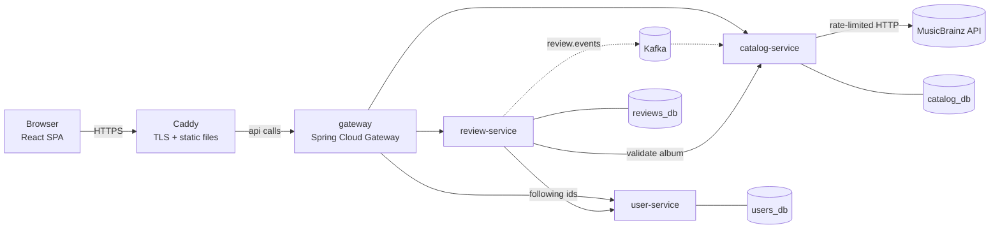

# Crate — Letterboxd for albums

> **Working name.** Product spec + technical design + build plan for a portfolio project focused on backend and distributed systems.
> Owner: Alex · Written: October 2026 · Lives in the repo as `docs/SPEC.md`.

---

## 0. How to read this document

**For Alex:** Sections 1–2 are the *why* and the rules. Section 13 is the roadmap you actually follow. Section 14 is what you must be able to explain before anything goes on your CV.

**For Claude Code:** This is the source of truth. Read section 2 (principles) and section 17 (working rules) before any task. Build only what belongs to the current phase. If the spec is wrong or incomplete, propose an edit instead of silently deviating.

---

## 1. Product

### 1.1 Why this exists

- **Personal goal:** listen to more music and swap good albums with friends.
- **Career goal:** a backend / distributed-systems project that is live, used by real people, and full of decisions Alex can defend in interviews.
- **Audience:** Alex + a small group of friends (invite-only). It may go public later. Nothing in the design should block that, but we don't build for it now.

### 1.2 Core concepts

| Concept | Definition |
|---|---|
| Album | A MusicBrainz *release group* with primary type Album or EP. Identified by its MBID (a UUID). |
| Rating | 0.5–5 stars in half steps. Stored as `smallint` 1–10. |
| Review | Optional text attached to a rating. One rating/review per user per album (MVP). |
| Follow | Asymmetric, like Letterboxd. "Friends" = people you follow. |
| Activity | Something a user did: rated, reviewed, followed, sent an album. |
| Feed | Activities of people you follow, newest first. |
| Notification | An activity directed at you: "X followed you", "X sent you an album". |

### 1.3 Features by phase

| Feature | Phase |
|---|---|
| Register (invite code) / login | 1 |
| Search albums, album page with average rating | 1 |
| Rate + review | 1 |
| Profile page with your ratings | 1 |
| Follow users | 1 |
| Friends feed (simple version) | 1 |
| Top albums (global, Bayesian ranking) | 1 (nice-to-have) |
| Notifications tab | 2 |
| Send an album to a friend | 2 |
| Listen-later list | 2 |
| Weekly top among friends | 2 |
| Recommendations | 4 |
| Diary, custom lists, "year in music" | 4 |

---

## 2. Guiding principles

1. **Backend first.** The frontend is a thin client. ~80% of the time goes to backend and infrastructure. Ugly but working UI is acceptable.
2. **Every phase ends deployed.** Something live beats something perfect on localhost.
3. **Measure, don't claim.** No number goes into the README or the CV unless it came from a test you can rerun.
4. **Write decisions down.** Each significant choice gets a short ADR in `docs/adr/` (section 16). These are your interview answers.
5. **Take deliberate shortcuts, and label them.** The MVP takes known shortcuts (section 3.6). Each one is documented and has a planned fix. That is a strength in an interview, not a weakness.
6. **Understand what you ship.** If Alex can't explain a piece of code, it doesn't go on the CV until he can.
7. **Budget ≤ €2/month.** Default target is €0.
8. **Exactly the services in this document.** No new service without an ADR.

---

## 3. Architecture

### 3.1 Overview (Phase 1)



Phase 2 adds `activity-service` (consumes `review.events` and user events, owns feeds and notifications).

### 3.2 Services and ownership

| Service | Owns (data) | Responsibilities | Phase |
|---|---|---|---|
| `gateway` | nothing | Single entry point, routing, JWT validation, injects `X-User-Id`, request IDs. Later: rate limiting. | 1 |
| `user-service` | users, follows | Registration, login, JWT issuing + JWKS endpoint, profiles, follow graph, user search. | 1 |
| `catalog-service` | albums, artists, album_stats, search cache | MusicBrainz integration, search, album details, rating aggregates (built from events), top albums. | 1 |
| `review-service` | reviews (later: listen-later) | Rate/review CRUD, per-album and per-user lists, feed v1 query. Publishes review events. | 1 |
| `activity-service` | activities, feed entries, notifications, shares, follow replica | Precomputed feeds (fan-out on write), notifications, "send album to friend". | 2 |

**Hard rule:** a service only touches its own database. Data from other services arrives via their API or via events. No shared tables, no shared JPA entities.

### 3.3 Communication

- **Synchronous (REST/JSON):** browser → gateway → service. Service-to-service calls only where unavoidable in the MVP (review → catalog to validate an album exists; review → user to get the list of followed IDs). Every sync call has explicit timeouts (2 s).
- **Asynchronous (Kafka):** state changes are announced as events. Consumers build their own read models from them.
- **Rule of thumb:** if the user is waiting for the answer → sync. If other services just need to *know it happened* → async.

### 3.4 Data

- **One Postgres instance** (to save RAM), **one database + one DB user per service**. Each user can only connect to its own database and owns it. This makes database-per-service a real boundary, not just a convention.
- **Migrations:** Flyway, per service, plain SQL in `src/main/resources/db/migration`.
- **IDs:** UUIDs. Albums and artists use their MusicBrainz MBIDs as primary keys. They are stable and global, so every service can reference an album without a mapping table.

### 3.5 Authentication flow

1. `POST /api/auth/login` → `user-service` checks the BCrypt hash and returns a signed JWT (RS256, 12 h TTL; claims: `sub` = userId, `username`, `iss`, `iat`, `exp`).
2. `user-service` exposes its public key at `/.well-known/jwks.json`. This path is **not** routed by the gateway to the outside; only the gateway fetches it internally.
3. The gateway validates every request on protected routes using the JWKS (Spring Security OAuth2 Resource Server). Everything under `/api` requires a token except `/api/auth/**`.
4. The gateway **removes** any incoming `X-User-Id` / `X-Username` headers (anti-spoofing), then sets them from the validated token.
5. Services read `X-User-Id`. Services are not reachable from the internet: only Caddy publishes ports.

**Why RS256 and not HS256:** only `user-service` holds the private key. Everyone else can verify tokens but cannot mint them.
**Why validate at the gateway:** one place to get security right while learning. Services validating tokens themselves comes in Phase 3.
**Invite-only:** registration requires an invite code from an env var (`INVITE_CODES`, comma-separated). This prevents random signups once the URL is public.

### 3.6 Deliberate MVP shortcuts

| Shortcut | Risk | Fixed in |
|---|---|---|
| Kafka event published *after* the DB commit (dual write) | If publishing fails after commit, the event is lost and `album_stats` drifts | Phase 2: transactional outbox |
| Feed = fan-out on read (`WHERE user_id IN (following)`) | Slower as follows grow; several calls per page | Phase 2: `activity-service`, fan-out on write |
| Services trust `X-User-Id` from the gateway | Anything inside the network could impersonate a user | Phase 3: services validate the JWT too |
| One long-lived access token in `localStorage` | XSS could steal it; no revocation | Phase 2: short access token + rotating refresh token in an httpOnly cookie |
| Sync call review → catalog without circuit breaker | Catalog down = nobody can rate | Phase 2: Resilience4j |
| Single instance of everything, Kafka replication factor 1 | No high availability | Accepted (friends app). Documented in an ADR. |

---

## 4. Tech stack

| Area | Choice | Why |
|---|---|---|
| Language | **Java 25** (LTS) | Current LTS; virtual threads, records, pattern matching. |
| Framework | **Spring Boot 4.1.x** | Current line. Alex already knows Spring from 8x8. |
| Spring Cloud | **2025.1.x (Oakwood), 2025.1.2 or newer** | Required for Boot 4.1 compatibility. |
| Gateway | Spring Cloud Gateway Server WebFlux (`spring-cloud-starter-gateway-server-webflux`) | Standard Spring gateway. |
| Security | Spring Security 7: BCrypt, OAuth2 Resource Server (validation), Nimbus JOSE (signing) | Little custom code, standard building blocks. |
| Persistence | Spring Data JPA (Hibernate 7) + **PostgreSQL 17** | Alex knows JPA; Postgres has trigram search built in. |
| Migrations | Flyway | Plain SQL files, minimal ceremony. |
| Messaging | **Apache Kafka 4.x** (KRaft mode, no ZooKeeper) + Spring for Apache Kafka | Industry standard; strong CV signal. |
| Cache / feeds | Redis or Valkey (Phase 2, only if measurements justify it) | — |
| HTTP client | Spring `RestClient` | Simple, synchronous, built in. |
| Resilience | Resilience4j (Phase 2) | Timeouts, retries, circuit breakers. |
| API docs | springdoc-openapi (the release line that supports Boot 4) | Swagger UI in dev. |
| Build | Gradle, Kotlin DSL, multi-project, version catalog (`gradle/libs.versions.toml`) | — |
| Tests | JUnit Jupiter, AssertJ, Mockito, Testcontainers, WireMock | Real Postgres/Kafka in tests. |
| Frontend | React + TypeScript + Vite, TanStack Query, React Router, Tailwind | What Alex knows; keep it thin. |
| Local containers | OrbStack (free for personal use) or Colima | Lighter than Docker Desktop on an M1. |
| Reverse proxy / TLS | Caddy | Automatic HTTPS, tiny config. |
| CI/CD | GitHub Actions, images in GHCR | Free for public repos. |
| Hosting | Oracle Cloud Always Free, Ampere A1 (ARM) | €0; same CPU architecture as the M1. |
| Orchestration | Docker Compose (Phases 1–2) → k3s (Phase 3) | Start simple, migrate with a reason. |
| Observability | Actuator + Micrometer → Prometheus + Grafana; Micrometer Tracing → OTLP → Tempo or Jaeger (Phase 3) | — |
| Load testing | k6 (Phase 3) | Scriptable, easy to reproduce. |

### 4.1 Version gotchas (important for Claude Code)

Spring Boot 4 differs from Boot 3 in ways that break copy-pasted code:

- **Modular starters.** Example: Flyway needs `spring-boot-starter-flyway`; Spring MVC is `spring-boot-starter-webmvc`. Flyway on Postgres also needs `flyway-database-postgresql`.
- **Jackson 3.** Main packages are `tools.jackson.*`, not `com.fasterxml.jackson.*` (annotations stay in `com.fasterxml.jackson.annotation`).
- **Spring for Apache Kafka 4.x** follows Jackson 3. Check which JSON (de)serializer classes are current; don't reuse Boot 3-era config blindly.
- **Spring Cloud Gateway** starters were renamed and properties moved to the `spring.cloud.gateway.server.webflux.*` prefix.
- Spring Boot ↔ Spring Cloud versions must match. Boot 4.1 requires Spring Cloud 2025.1.2+.

**When unsure about a class name, starter or property: say so and check the current docs. Do not assume Boot 3.**

---

## 5. Service specifications

Paths below are as seen by the service. The public path is `/api` + path (the gateway strips the `/api` prefix).

### 5.1 gateway

**Routes**

| Public path | Target | Auth |
|---|---|---|
| `/api/auth/**` | user-service | public |
| `/api/users/**` | user-service | JWT |
| `/api/albums/**` | catalog-service | JWT |
| `/api/reviews/**` | review-service | JWT |
| `/api/feed/**`, `/api/notifications/**`, `/api/shares/**` | activity-service (Phase 2) | JWT |

**Responsibilities:** JWT validation via JWKS; strip + inject identity headers; generate and propagate `X-Request-Id`; access logs.
**Phase 3:** request rate limiting (especially `/api/auth/login`).
**CORS:** not needed in production (same origin via Caddy). In development, Vite proxies `/api` to the gateway.

### 5.2 user-service

**Data model**

```sql
create table users (
  id            uuid primary key,
  username      varchar(30)  not null unique,   -- lowercase, [a-z0-9_]
  email         varchar(254) not null unique,
  password_hash varchar(100) not null,          -- BCrypt
  display_name  varchar(60),
  created_at    timestamptz  not null default now()
);

create table follows (
  follower_id uuid not null references users(id) on delete cascade,
  followee_id uuid not null references users(id) on delete cascade,
  created_at  timestamptz not null default now(),
  primary key (follower_id, followee_id),
  check (follower_id <> followee_id)
);
create index follows_followee_idx on follows (followee_id);
```

**Endpoints**

| Method & path | Body / params | Result |
|---|---|---|
| `POST /auth/register` | `{username, email, password, inviteCode}` | 201 `{id, username}` |
| `POST /auth/login` | `{login, password}` (username or email) | 200 `{accessToken, expiresAt}` |
| `GET /.well-known/jwks.json` | — | JWKS (internal only) |
| `GET /users/me` | — | current user |
| `PATCH /users/me` | `{displayName}` | updated user |
| `GET /users/{username}` | — | public profile + follower/following counts |
| `GET /users?ids=a,b,c` | max 100 ids | batch lookup (used to render feeds) |
| `GET /users/search?q=` | — | users matching username/display name |
| `PUT /users/{id}/follow` | — | 204, idempotent |
| `DELETE /users/{id}/follow` | — | 204, idempotent |
| `GET /users/{id}/following`, `GET /users/{id}/followers` | cursor, limit | paged lists |
| `GET /users/{id}/following/ids` | — | internal: used by review-service feed v1 |

**Rules:** password minimum 10 characters; BCrypt; login errors never reveal whether the account exists.
**Phase 2:** publishes follow events via the outbox (section 6).

### 5.3 catalog-service

**Data model**

```sql
create extension if not exists pg_trgm;  -- trusted extension: the DB owner can create it

create table artists (
  id        uuid primary key,          -- MusicBrainz artist MBID
  name      text not null,
  sort_name text
);

create table albums (
  id                 uuid primary key,  -- MusicBrainz release-group MBID
  title              text not null,
  artist_credit      text not null,     -- display string, e.g. "Simon & Garfunkel"
  primary_artist_id  uuid references artists(id),
  primary_type       varchar(20),       -- Album | EP
  secondary_types    text[],            -- e.g. {Live} or {Compilation}; null = unknown (stored before V3)
  first_release_date varchar(10),       -- MB dates can be partial: "1997" or "1997-05"
  release_count      integer,           -- releases in the group (popularity); only search results report it
  search_text        text not null,     -- normalized in Java: lowercase, no diacritics, title + artist
  fetched_at         timestamptz not null
);
create index albums_search_trgm on albums using gin (search_text gin_trgm_ops);

-- No FK to albums on purpose: events may arrive before the album row exists.
create table album_stats (
  album_id     uuid primary key,
  rating_count integer not null default 0,
  rating_sum   integer not null default 0     -- sum of 1–10 values
);

create table search_cache (
  normalized_query text primary key,
  fetched_at       timestamptz not null
);

-- MusicBrainz's ranked answer per cached query (ADR-010)
create table search_results (
  normalized_query text    not null references search_cache on delete cascade,
  album_id         uuid    not null references albums on delete cascade,
  rank             integer not null,
  primary key (normalized_query, album_id)
);

create table processed_events (
  event_id     uuid primary key,
  processed_at timestamptz not null default now()
);
```

**Cover images** are not stored. Build the URL from the MBID: `https://coverartarchive.org/release-group/{id}/front-250` (or `front-500` on the album page). The frontend shows a placeholder when the image doesn't exist.

**MusicBrainz integration rules**

- Base URL `https://musicbrainz.org/ws/2/`, always `fmt=json`.
- Always send a meaningful User-Agent, e.g. `Crate/0.1 ( alex@example.com )`. Requests without one get blocked.
- **Rate limit: about 1 request per second** from our IP. Enforce it globally in-process with a token bucket (one catalog instance in the MVP). On HTTP 503: back off with jitter and retry, maximum 3 times.
- Never call MusicBrainz inside a DB transaction.
- Build Lucene queries in one place (`MusicBrainzQueryBuilder`). If the input contains `" - "`, split it into artist and title.
- Keep only release groups with primary type Album or EP. In search, also drop the excluded secondary types (`MusicBrainzQueryBuilder.EXCLUDED_SECONDARY_TYPES`) unless the title is exactly the query; lookups by id keep them.
- Exact query syntax and `inc=` parameters: verify against the MusicBrainz API docs. Capture real responses once and keep them as WireMock fixtures.

**Search algorithm (read-through cache of MusicBrainz's ranking, ADR-010)**

1. Normalize the query: lowercase, strip diacritics (`java.text.Normalizer`), collapse whitespace.
2. If the normalized query is in `search_cache` and younger than 7 days → return its stored `search_results` in rank order.
3. Otherwise ask MusicBrainz (rate-limited, outside any DB transaction), 1–3 requests:
   1. The query, 100 results: every word required in title or artist; compilations, live albums, remixes, DJ-mixes, mixtapes, demos etc. excluded unless the title is exactly the query (soundtracks stay).
   2. Only if that found nothing: the same query allowing misspellings (`word~` for words of 4+ letters).
   3. If the whole query is the name of an artist credited in the results ("radiohead", "beatles", "bjork"): that artist's albums.
4. Rank: the artist's albums first, most releases first; then the query's results by MusicBrainz score + 15 × ln(1 + release count) (`crate.catalog.search.popularity-weight`). Upsert albums and artists (`INSERT … ON CONFLICT DO UPDATE`, in MBID order so concurrent searches can't deadlock), then in one transaction record the query in `search_cache` (even when MusicBrainz found nothing) and replace its `search_results`. Return them.
5. If MusicBrainz fails or times out → local fallback with `partial: true`: trigram **word similarity** on `search_text` (`query <% search_text`, ≥ 0.5, served by the GIN index), excluded secondary types left out, most releases first among equal matches. **Never fail a search because MusicBrainz is down.**

Search quality is measured with `services/catalog-service/search-eval` (30 queries, hit@3); rerun it when changing anything above.

**Album details:** local hit → return it. Miss → look it up on MusicBrainz, upsert, return. 404 if MusicBrainz doesn't know it (or it isn't an Album/EP); **503** if MusicBrainz can't be reached, because then we can't tell whether it exists. (Phase 2: refresh in the background when `fetched_at` is older than 30 days.)

**Endpoints**

| Method & path | Result |
|---|---|
| `GET /albums/search?q=&limit=20` | `{items: [{id, title, artistCredit, year, coverUrl, avgRating, ratingCount}], partial}`; `q` 1–100 chars, `limit` 1–50 |
| `GET /albums/{id}` | album details + stats |
| `GET /albums?ids=a,b,c` | `{items: [...]}`, max 100, stored albums only, request order (used to render feeds) |
| `GET /albums/top?limit=50` | ranked by Bayesian average (nice-to-have) |

**Ranking (Bayesian average):** `score = (v / (v + m)) * R + (m / (v + m)) * C`, where `v` = number of ratings, `R` = album average, `C` = global average, `m` = 3. This stops a single 5-star rating from topping the chart.

**Consumes `review.events`** (consumer group `catalog-service`):

| Event | Effect on `album_stats` |
|---|---|
| `ReviewCreated` | count + 1, sum + rating |
| `ReviewUpdated` | sum + (newRating − oldRating), only if the rating changed |
| `ReviewDeleted` | count − 1, sum − rating |

Insert into `processed_events` in **the same DB transaction** as the stats update. If the event ID already exists, it was already processed: skip it. The Kafka offset is committed only after the listener returns, which happens after the DB commit.

Note for interviews: deltas are commutative, so for *sums* the order doesn't matter, but idempotency does. Per-key ordering still matters for other consumers (Phase 2).

**Seed job:** `seed/albums.txt` holds lines of the form `Artist - Title`, for example your 200–300 favorite albums. A `seed` Spring profile runs a `CommandLineRunner` that resolves each line through the rate-limited client and upserts it. 300 albums take about 5 minutes.

### 5.4 review-service

**Data model**

```sql
create table reviews (
  id         uuid primary key,
  user_id    uuid not null,       -- no FK: users live in user-service
  album_id   uuid not null,       -- no FK: albums live in catalog-service
  rating     smallint not null check (rating between 1 and 10),
  body       text check (char_length(body) <= 5000),
  created_at timestamptz not null default now(),
  updated_at timestamptz not null default now(),
  version    bigint not null default 0,   -- optimistic locking (@Version)
  unique (user_id, album_id)
);
create index reviews_album_idx on reviews (album_id, created_at desc, id desc);
create index reviews_user_idx  on reviews (user_id,  created_at desc, id desc);
```

**Endpoints**

| Method & path | Notes |
|---|---|
| `PUT /reviews/albums/{albumId}` `{rating, body?}` | Upsert my review. 201 created / 200 updated. Validates the album exists via `GET catalog/albums/{id}` (2 s timeout). |
| `DELETE /reviews/albums/{albumId}` | 204 |
| `GET /reviews/albums/{albumId}/me` | my review or 404 |
| `GET /reviews/albums/{albumId}?cursor=&limit=20` | reviews of an album |
| `GET /reviews/users/{userId}?cursor=&limit=20` | a user's reviews (profile page) |
| `GET /reviews/feed?cursor=&limit=20` | **Feed v1:** fetch following IDs from user-service, then `WHERE user_id = ANY(:ids)` ordered by `(created_at, id) DESC` |

The frontend renders feed items by batch-fetching albums (`GET /albums?ids=`) and users (`GET /users?ids=`).

**Concurrency:** the unique `(user_id, album_id)` constraint plus `@Version`. A double-click that hits the unique constraint is caught, re-read, and handled as an update.

**Events:** after a successful commit, publish to `review.events` with key = `albumId`: `ReviewCreated`, `ReviewUpdated` (only if rating or body changed; includes `oldRating`), `ReviewDeleted`. MVP uses `@TransactionalEventListener(phase = AFTER_COMMIT)`. This is the known dual-write shortcut from section 3.6.

### 5.5 activity-service (Phase 2)

**Purpose:** the notifications tab ("what my friends rated", "X followed you", "X sent you an album") and a feed that doesn't get slower as follows grow.

**Data model (sketch)**

```sql
create table follows_replica (
  follower_id uuid not null,
  followee_id uuid not null,
  primary key (follower_id, followee_id)
);
create table activities (
  id             uuid primary key,
  actor_id       uuid not null,
  type           varchar(30) not null,   -- RATED | REVIEWED | FOLLOWED | SHARED
  album_id       uuid,
  target_user_id uuid,
  rating         smallint,
  created_at     timestamptz not null
);
create table feed_entries (
  owner_id    uuid not null,
  activity_id uuid not null,
  created_at  timestamptz not null,
  primary key (owner_id, activity_id)
);
create index feed_entries_owner_idx on feed_entries (owner_id, created_at desc);
create table notifications (
  id           uuid primary key,
  recipient_id uuid not null,
  activity_id  uuid not null,
  read_at      timestamptz,
  created_at   timestamptz not null
);
create table shares (
  id           uuid primary key,
  from_user_id uuid not null,
  to_user_id   uuid not null,
  album_id     uuid not null,
  note         text,
  created_at   timestamptz not null
);
-- plus processed_events, same as catalog-service
```

**Behavior**

- **Fan-out on write:** on `ReviewCreated` by X → one `activities` row, plus one `feed_entries` row for each follower of X (looked up in `follows_replica`).
- **Follow replica (event-carried state transfer):** built from a compacted Kafka topic `follow.state` (section 6). Replaying it from the beginning rebuilds the replica from scratch.
- **Shares:** `POST /shares {toUserId, albumId, note}` → creates a notification for the recipient. This is the "swap good albums with friends" feature.
- **Endpoints:** `GET /feed`, `GET /notifications`, `POST /notifications/read`, `POST /shares`, `GET /shares/inbox` (cursor pagination).
- **Redis:** only after measuring the Postgres version with k6. If needed: keep the latest 200 feed IDs per user in a sorted set.
- **Interview topic for the ADR:** the celebrity problem. Fan-out on write is expensive for users with huge follower counts; the usual fix is a hybrid (fan-out on read for them). Not needed at friend scale, but write it down.

---

## 6. Events (Kafka)

### 6.1 Envelope

```json
{
  "eventId": "0b9f6c1e-2a7d-4c1f-9c3e-5d8f7a1b2c3d",
  "eventType": "ReviewCreated",
  "eventVersion": 1,
  "occurredAt": "2026-10-03T18:21:07Z",
  "producer": "review-service",
  "payload": {
    "reviewId": "…",
    "userId": "…",
    "albumId": "…",
    "rating": 8,
    "hasBody": true
  }
}
```

### 6.2 Topics

| Topic | Key | Producer | Consumers | Phase |
|---|---|---|---|---|
| `review.events` | albumId | review-service | catalog-service, activity-service | 1 / 2 |
| `follow.state` (compacted) | `followerId:followeeId` | user-service | activity-service | 2 |
| `<topic>.DLT` | same as source | Spring Kafka error handler | inspected manually | 2 |

- 3 partitions per topic. That is enough to demonstrate consumer-group parallelism; more is pointless on one broker.
- Replication factor 1 (single broker). This is a documented limitation.
- `follow.state`: value `{ "followed": true, "at": "…" }` on follow, **tombstone** (null value) on unfollow. Log compaction keeps the latest state per key.

### 6.3 Rules

- **Delivery is at-least-once.** Every consumer must be idempotent: a `processed_events` row inserted in the same transaction as the side effect.
- **Ordering is guaranteed only per key** (that is, per partition).
- **Events are facts, in the past tense.** No commands such as `UpdateAlbumStats`.
- **Schema evolution:** additive changes only. A breaking change means a new `eventVersion`, and consumers handle both versions during the transition.
- **Shared contracts:** `libs/event-contracts` holds the envelope and payload records. It is the *only* code shared between services: no Spring, no JPA inside.
- **Don't rely on Java type headers** in Kafka messages; they couple consumers to the producer's class names. Deserialize the envelope and dispatch on `eventType`.

### 6.4 Error handling (Phase 2)

`DefaultErrorHandler` with exponential backoff (3 attempts) → `DeadLetterPublishingRecoverer` to `<topic>.DLT`. A poison message must never block a partition.

### 6.5 Transactional outbox (Phase 2)

```sql
create table outbox (
  id           uuid primary key,
  aggregate_id uuid not null,          -- becomes the Kafka key
  topic        varchar(100) not null,
  event_type   varchar(60)  not null,
  payload      jsonb        not null,
  created_at   timestamptz  not null default now(),
  published_at timestamptz
);
create index outbox_unpublished_idx on outbox (created_at) where published_at is null;
```

1. Write the business row and the outbox row **in one transaction**.
2. A scheduled relay (every ~200 ms) selects unpublished rows with `FOR UPDATE SKIP LOCKED LIMIT 100`, sends them to Kafka, waits for the broker ack, then sets `published_at`.
3. This is still at-least-once: a crash between send and update means a resend. Consumer idempotency covers that.
4. Cleanup job: delete published rows older than 7 days.

Alternative considered: Debezium CDC. It has more moving parts and uses more RAM; record it in the ADR.

---

## 7. API conventions

- JSON, camelCase. Timestamps in ISO-8601 UTC.
- **Errors:** RFC 9457 Problem Details (Spring `ProblemDetail`) with `type`, `title`, `status`, `detail`, plus an `errors` array for validation failures.
- **Validation:** Jakarta Bean Validation on request records → 400 with field errors.
- **Pagination:** cursor-based (`cursor`, `limit` ≤ 50). Response: `{ "items": [...], "nextCursor": "…" | null }`. The cursor is base64 of `createdAt|id`; the query uses `WHERE (created_at, id) < (:createdAt, :id)`. It is stable under inserts and doesn't degrade with depth, unlike `OFFSET`.
- **Idempotency:** rating is a `PUT` on `/reviews/albums/{id}`; following is a `PUT`. Repeating either request is harmless.
- **Tracing:** every request carries `X-Request-Id` (generated at the gateway if absent) and every service logs it.
- **OpenAPI:** springdoc per service; Swagger UI only in the `local` profile.

---

## 8. Repository layout

```
crate/
├── CLAUDE.md
├── README.md
├── Makefile
├── docs/
│   ├── SPEC.md                 ← this document
│   ├── benchmarks.md           (Phase 3)
│   └── adr/
├── services/
│   ├── gateway/
│   ├── user-service/
│   ├── catalog-service/
│   ├── review-service/
│   └── activity-service/       (Phase 2)
├── libs/
│   └── event-contracts/
├── frontend/
├── infra/
│   ├── compose/
│   │   ├── docker-compose.yml          infra: postgres, kafka
│   │   ├── docker-compose.apps.yml     the services
│   │   ├── docker-compose.prod.yml     + caddy, prod overrides
│   │   └── postgres-init/              creates DBs + users
│   ├── caddy/Caddyfile
│   └── k8s/                    (Phase 3)
├── load-tests/                 (Phase 3, k6)
├── seed/albums.txt
├── gradle/libs.versions.toml
└── settings.gradle.kts
```

Inside each service, **package by feature**, not by layer: `review/ReviewController`, `review/ReviewService`, `review/ReviewRepository`, `events/…`.

---

## 9. Local development (M1, low RAM and disk)

- **Container runtime:** OrbStack (works with Testcontainers out of the box) or Colima (fully open source; Testcontainers needs a couple of env vars, see its docs).
- **Run infrastructure in containers and services from the IDE/Gradle.** Only run the services you are working on.
- **Approximate memory budget** (verify with `docker stats` / Activity Monitor):

| Process | Target |
|---|---|
| Postgres | ~150–250 MB |
| Kafka (KRaft, heap 384 MB) | ~500–600 MB |
| Each Spring Boot service (`-Xmx256m`) | ~300–400 MB |
| Vite dev server | ~200 MB |
| **All 4 services + infra** | **≈ 2.5–3 GB** |

- **Dev JVM flags:** `-Xmx256m -XX:+UseSerialGC -XX:TieredStopAtLevel=1` (less memory, faster startup; dev only).
- **Kafka listeners:** you need two listeners: one for containers (`kafka:9092`) and one for apps running on the Mac (`localhost:29092`). Most "can't connect to Kafka" bugs are a wrong `advertised.listeners`.
- **Disk:** run `docker system prune` periodically and prefer `-jre` / `-alpine` images.
- **Kafka UI** (kafbat/kafka-ui) is optional and costs ~300 MB. Start it only when debugging.
- **Spring profiles:** `local` (host ports, Swagger UI), `docker`, `prod`.
- **Makefile targets:** `infra-up`, `infra-down`, `test`, `up-all`, `seed`, `logs`.
- **Bonus:** the M1 is arm64, like the Oracle A1 server, so images built locally run on the server without cross-compilation.

---

## 10. Testing strategy

| Level | What | Tools |
|---|---|---|
| Unit | Pure logic: rating math, Bayesian score, cursor encoding, query normalization, MusicBrainz query builder | JUnit, AssertJ (Mockito sparingly) |
| Integration | At least one test per endpoint (happy path + main error) and per Kafka consumer, **including "same event twice → processed once"** | `@SpringBootTest` + Testcontainers (Postgres, Kafka) with `@ServiceConnection` |
| External HTTP | MusicBrainz client, including 503 + backoff and rate limiting | WireMock with recorded fixtures. **Never call the real API in tests.** |
| Smoke | Against the full compose stack: register → login → search → rate → album average updates (poll ≤ 5 s) | shell script or k6 |

CI green is required before merging.

---

## 11. CI/CD

- **`ci.yml`** (on pull request and push): Gradle build + all tests (Testcontainers runs on GitHub's Ubuntu runners); frontend lint + build. Use the Gradle setup action for caching.
- **`release.yml`** (on push to `main`): build one image per service for `linux/arm64` and push to `ghcr.io/<user>/crate-<service>:<git-sha>` and `:latest`. Use GitHub's arm64 runner (`ubuntu-24.04-arm`, free for public repos at the time of writing) or fall back to buildx + QEMU (slower).
- **Deploy (Phases 1–2):** a job that SSHes to the VM and runs `docker compose pull && docker compose up -d`. SSH key and host go in GitHub Actions secrets. The server's `.env` lives only on the VM; `.env.example` is committed.
- **Dockerfile:** multi-stage, `eclipse-temurin:25-jre` base, Spring Boot layered jar, non-root user, `-XX:MaxRAMPercentage=75` with a container memory limit.
- **Nice-to-have:** path filters so only changed services get rebuilt.

---

## 12. Deployment (≤ €2/month)

### 12.1 Phases 1–2: one VM + Docker Compose

**Oracle Cloud Always Free, Ampere A1 (ARM) VM.**

- Reports from mid-2026 say the free A1 allowance was **cut from 4 OCPU / 24 GB to 2 OCPU / 12 GB**. Size the VM at **2 OCPU / 12 GB** and check the current limits in the console. That is plenty: the whole stack needs about 4–5 GB.
- Signup needs a card for verification. Always Free resources aren't charged.
- "Out of capacity" errors when creating A1 instances are common. Retry, or try another availability domain.
- **Idle reclamation:** Always Free instances can be reclaimed if they stay idle for 7 days (low CPU/network/memory). A running stack with several JVMs and Kafka normally keeps memory above the threshold. Check the current rules. Alternative: upgrade the account to Pay-As-You-Go (it stays free within the Always Free limits) and set a **budget alert at €1**.
- **Open ports 80/443 in two places:** the VCN security list *and* the VM's own firewall (Oracle's Ubuntu images ship with restrictive iptables rules).
- **Only Caddy publishes ports.** Postgres, Kafka and the services stay on the internal Docker network. SSH with a key only, password login disabled.

**Domain:** a free DuckDNS subdomain (e.g. `crate-alex.duckdns.org`). Caddy gets a Let's Encrypt certificate automatically. A real domain can come later (the GitHub Student Developer Pack has sometimes included one free for a year; check current offers).

**Caddyfile sketch**

```
{$DOMAIN} {
    encode zstd gzip

    handle /api/* {
        reverse_proxy gateway:8080
    }

    handle {
        root * /srv/www
        try_files {path} /index.html
        file_server
    }
}
```

**Backups:** a nightly `pg_dumpall` via cron, keeping 7 days on the VM. Copy one dump off the VM weekly (to your laptop or free object storage). **Test a restore once.** An untested backup isn't a backup.

**If Oracle doesn't work out:** run on the laptop with a Cloudflare quick tunnel for demos, or use student cloud credits (GitHub Student Developer Pack, Azure for Students; check current offers). Cheap paid VPSes are above the €2 budget.

### 12.2 Phase 3: k3s on the same VM

- Single-node k3s. It bundles Traefik as ingress; either use Traefik with its built-in Let's Encrypt support, or keep Caddy as the ingress. Decide in an ADR.
- Per service: `Deployment` (requests/limits, liveness + readiness probes on Actuator health groups), `Service`, `ConfigMap`, `Secret`.
- Postgres and Kafka as `StatefulSet`s with PVCs (k3s local-path provisioner).
- Plain YAML + Kustomize overlays. Helm only if a real need appears.
- k3s itself uses roughly 0.5–1 GB, which fits in 12 GB.

---

## 13. Roadmap

> **Reality check.** At 10–20 h/week, two weeks is about 20–40 hours. That is **tight** for someone learning Spring Security, Kafka and microservices at the same time. Phase 1 is split into MUST and NICE. If you are behind at the end of week 1, cut NICE items without guilt. **Never cut:** the deploy, the Kafka flow, or tests on the core path.

### Phase 0 — Skeleton (≈ 4–6 h)

- Gradle multi-project, version catalog, Java 25 toolchain.
- Four services that start, expose `/actuator/health`, and have Flyway + DB connection.
- Compose infra: Postgres with an init script that creates DBs and users; Kafka in KRaft mode.
- `libs/event-contracts` module.
- CI: build + test on pull request.
- Frontend: Vite + React + TS with routing and the `/api` proxy.
- ADR-001 to ADR-003 written.

**Done when:** `make infra-up` + all services report healthy, and CI is green.

### Phase 1 — MVP (≈ 2 weeks)

**Week 1: auth + catalog**

- MUST: user-service register (invite code), login, JWT + JWKS; gateway validation and header injection; `GET /users/me`.
- MUST: catalog-service MusicBrainz client (User-Agent, token bucket, retries), read-through search, album details, batch endpoint.
- MUST: frontend login/register, search page, album page (read-only).
- NICE: seed job.

**Week 2: reviews + events + social + deploy**

- MUST: review-service upsert/delete review, album reviews list, "my review"; publishes `review.events`.
- MUST: catalog-service consumer → `album_stats` (idempotent); album page shows average and count.
- MUST: follow/unfollow, profile page with ratings, feed v1.
- MUST: deploy to the VM (compose + Caddy + DuckDNS); CI pushes images; invite 3 friends.
- NICE: top albums (Bayesian), user search, edit/delete UI, README polish.

**Done when:** friends can register with an invite code, search, rate, follow each other and see each other's ratings in the feed. Album averages update within seconds. There is a live URL, a README with an architecture diagram and run instructions, and integration tests on all core paths.

**Interview story you'll have:** "Microservices with JWT/JWKS auth at the gateway; event-driven rating aggregation with Kafka keyed by album and idempotent consumers; MusicBrainz integration under a 1 req/s limit with token-bucket rate limiting and a read-through cache."

### Phase 2 — Event-driven for real + social (≈ 3 weeks)

- Transactional outbox in review-service and user-service, removing the dual write.
- Retries + DLT for all consumers.
- `activity-service`: follow replica from the compacted topic, fan-out-on-write feed, notifications tab, "send album to a friend".
- Listen-later list (review-service).
- Weekly top albums among friends.
- Resilience4j on review → catalog and review → user calls.
- Short access token + rotating refresh token in an httpOnly cookie.
- Redis only if measurements justify it.

**Done when:** you can **stop Kafka for 2 minutes during writes**, start it again, and no events are lost (stats are correct). A deliberately broken message lands in the DLT without blocking the partition. This makes a great demo and a great interview story.

### Phase 3 — Operate it (≈ 2–3 weeks)

- Migrate to k3s: Kustomize, probes, resource limits, rolling deploys from CI.
- Observability: Prometheus + Grafana (request rate, errors and latency per service; Kafka consumer lag); traces across gateway → service → Kafka → consumer; structured JSON logs with trace IDs.
- k6 load tests: feed v1 vs v2 latency, rating throughput, consumer lag during a burst. Publish results **and method** (hardware, data size, script) in `docs/benchmarks.md`.
- Services validate the JWT themselves (defense in depth).

**Done when:** you have a Grafana dashboard worth a README screenshot and a benchmark document with reproducible numbers.

### Phase 4 — Make it yours (open-ended)

- **Recommendations v1:** content-based. Take MusicBrainz genres of albums you rated ≥ 4★, weight albums your friends rated highly, exclude what you've already rated. Be honest about cold start. v2: item-item collaborative filtering once there is enough data.
- Diary (multiple dated listens), custom lists, "year in music" stats (batch job; maybe Kafka Streams).
- **Account deletion as a distributed problem:** a `UserDeleted` event; every service deletes or anonymizes its data (GDPR right to erasure).
- Optional: GraalVM native images to cut memory.

---

## 14. Learning checklist

Before a topic goes on the CV, Alex should be able to explain it out loud in ~2 minutes, without notes.

**Phase 1**
- [ ] What a JWT contains; how RS256 signing and verification work; why JWKS exists
- [ ] Spring Security: `SecurityFilterChain`, how a request gets authenticated, why BCrypt and not SHA-256
- [ ] Gateway pattern: what it solves, what it costs (extra hop, single point of failure)
- [ ] Kafka: topic, partition, offset, consumer group, rebalance; how the key picks the partition; why that gives per-album ordering
- [ ] At-least-once delivery and why consumers must be idempotent
- [ ] Database per service: why no cross-service joins, and what to do instead
- [ ] Token-bucket rate limiting; read-through cache; TTL
- [ ] Cursor vs offset pagination
- [ ] Bayesian average

**Phase 2**
- [ ] The dual-write problem; transactional outbox; why it is still at-least-once
- [ ] Fan-out on read vs fan-out on write; the celebrity problem
- [ ] Event-carried state transfer; log compaction and tombstones
- [ ] Retries, backoff, dead-letter topics; circuit breaker states
- [ ] Access vs refresh tokens; httpOnly cookies; XSS vs CSRF

**Phase 3**
- [ ] Pod, Deployment, Service, Ingress; liveness vs readiness probes
- [ ] Requests vs limits; what OOMKilled means for a JVM
- [ ] Metrics vs logs vs traces; p50/p95/p99; consumer lag
- [ ] How to design a fair load test

---

## 15. CV bullet templates

Fill in **only with real, reproducible numbers**. Delete any bullet you can't back up.

- Designed and deployed a microservices platform (Java 25, Spring Boot 4, Kafka, PostgreSQL) for rating and reviewing music albums, used by [N] people.
- Built event-driven rating aggregation over Kafka with idempotent consumers and a transactional outbox, guaranteeing no lost updates during broker outages.
- Integrated the MusicBrainz API under a 1 req/s limit using token-bucket rate limiting and a read-through cache, serving [X]% of searches locally at p95 [Y] ms.
- Replaced fan-out-on-read feeds with fan-out-on-write, reducing feed p95 latency from [A] ms to [B] ms under k6 load tests.
- Deployed on Kubernetes (k3s) with CI/CD (GitHub Actions, GHCR), Prometheus/Grafana metrics and distributed tracing.

---

## 16. Architecture Decision Records

**Template** (`docs/adr/NNN-title.md`):

```
# ADR-NNN: Title
Date: YYYY-MM-DD · Status: accepted | superseded by ADR-XXX

## Context
## Decision
## Alternatives considered
## Consequences (good and bad)
```

**Initial ADRs**

| # | Decision |
|---|---|
| 001 | Microservices (exactly 4 in Phase 1), chosen to learn. A modular monolith would be simpler; we accept the cost knowingly. |
| 002 | Database per service on one Postgres instance, enforced with separate DB users. |
| 003 | MusicBrainz as catalog source with lazy read-through ingestion instead of importing the full dump (laptop disk/RAM limits). |
| 004 | JWT (RS256) issued by user-service, validated at the gateway; trusted internal network in the MVP. |
| 005 | Kafka for async events; `review.events` keyed by albumId. |
| 006 | Publish-after-commit in the MVP (known dual-write risk) → outbox in Phase 2. |
| 007 | Feed: fan-out on read (MVP) → fan-out on write (Phase 2). |
| 008 | Same-origin deployment behind Caddy, so no CORS in production. |
| 009 | Hosting on Oracle Always Free (ARM), with fallbacks. |
| 010 | Search ranking: MusicBrainz ranks (AND query, secondary types excluded, artist's albums first, score + popularity); we cache the ranking per query. Measured with a 30-query eval set. |

---

## 17. Working rules for Claude Code

- **Source of truth:** `docs/SPEC.md`. If something here is wrong or missing, propose an edit to the spec instead of silently deviating.
- **One task from the current phase at a time.** Don't add features, services or dependencies from later phases. Ask before adding any new dependency.
- **Alex is learning.** For anything involving security, Kafka, transactions or concurrency: first explain the concept and the plan in a few sentences, then implement, then summarize what changed and what to read next. Prefer clear code over clever code.
- **Boot 4 / Spring Cloud 2025.1 / Jackson 3:** don't reproduce Boot 3-era config from memory (section 4.1). When unsure, say so and check the docs.
- **Tests:** every endpoint and every consumer gets a Testcontainers integration test. No real external API calls in tests.
- **No secrets in git.** Config via env vars; `.env.example` committed, `.env` git-ignored.
- **Boundaries:** never touch another service's database or import another service's code (the only exception is `libs/event-contracts`).
- **Shortcuts:** when taking a deliberate shortcut, add it to section 3.6 and to the relevant ADR.
- **Commits:** small, with conventional commit messages (`feat:`, `fix:`, `test:`, `docs:`, `chore:`).

### 17.1 Suggested `CLAUDE.md`

```markdown
# Crate

Letterboxd for albums. Microservices portfolio project:
Java 25, Spring Boot 4.1, Spring Cloud 2025.1, Kafka 4 (KRaft), PostgreSQL 17, React + TS.

Read docs/SPEC.md before any task. Current phase: **Phase 0**.

## Rules
- Build only what the current phase needs. Ask before adding dependencies.
- I'm learning: explain concepts (security, Kafka, transactions, concurrency) before
  implementing them, and summarize what changed afterwards.
- Spring Boot 4 + Jackson 3 + Spring Cloud 2025.1: verify starter names, packages and
  property prefixes; don't assume Boot 3.
- Every endpoint and consumer has a Testcontainers integration test.
  Never call real external APIs in tests.
- A service never touches another service's DB. Only libs/event-contracts is shared.
- No secrets in git. Conventional commits.

## Commands
- make infra-up / make infra-down
- ./gradlew build
- ./gradlew :services:<name>:bootRun --args='--spring.profiles.active=local'
```

---

## 18. Open questions (decide later)

- Final project name.
- Allow logging an album as "listened" without a rating (Letterboxd allows this)?
- Should album pages be public (shareable links) or invite-only like everything else?
- On k3s: Traefik or Caddy as ingress?
- "Year in music": batch job or Kafka Streams?
